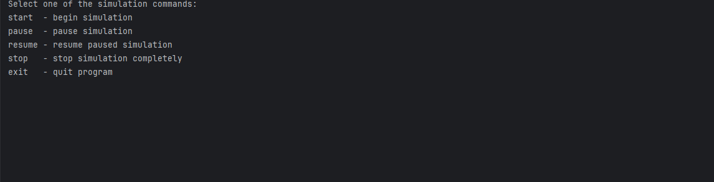
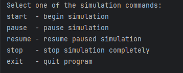

# Simulation
Simulation - пошаговая симуляция 2D мира, населённого травоядными и хищниками. Кроме существ, мир содержит ресурсы (траву), которыми питаются травоядные, и статичные объекты, с которыми нельзя взаимодействовать - они просто занимают место.

2D мир представляет из себя матрицу NxM, каждое существо или объект занимают клетку целиком, нахождение в клетке нескольких объектов/существ - недопустимо.

Это второй проект из Java Роадмап Сергея Жукова https://zhukovsd.github.io/java-backend-learning-course/

---
## Описание игры 
Проект написан на 22 версии java.
- Размер игрового поля 7 на 10. Можно поменять размер в классе Main.java;
- В классе ActionUtils.java можно поменять количество сущностей на игровом поле и значения их характеристик;
- В симуляции никогда не бывает ситуаций, что нет травы или травоядных. Если количество травы становится меньше или равно количеству травоядных - генерируется новая трава. Если количество травоядных становится меньше или равно количеству хищников - генерируются новые травоядные;
- Травоядные имеют здоровье и скорость (количество ячеек, которое можно пройти за одну итерацию игрового цикла). Хищники имеют здоровье, скорость и силу атаки (количество урона, которое хищник наносит травоядному при атаке);
- Одна итерация игрового цикла включает в себя рендер текущего состояния игрового поля, а также движения травоядных/хищников к еде. Если травоядное/хищник находится на расстоянии одной клетки от еды, то они могут её атаковать;
- Травоядное за одну итерацию игрового цикла может либо переместиться по направлению к еде, либо атаковать её (съесть, трава пропадёт с игрового поля) . Хищник за одну итерацию игрового цикла может переместиться по направлению к еде, и если после перемещения он будет на расстоянии одной клетки от еды, он сможет сразу её атаковать, не дожидаясь следующей итерации игрового цикла. Если здоровье травоядного опускается до 0, то хищник "съедает" травоядное (травоядное пропадает с игрового поля);
- Условие выхода из симуляции - введение команды 'exit'.
---
## Пример игрового процесса

---
## Инструкии
1. Клонируйте репозиторий 
git clone https://github.com/PetrovYegor/Simulation
2. Скомпилируйте и запустите проект
---
## Как играть

При запуске программы в консоль распечатается игровое меню с возможными командами:

start - если симуляция не была запущена - начинается новая;

pause - поставить симуляцию на паузу (поток продолжает работать, но не выполняет логику);

resume - снять с паузы симуляцию;

stop - полностью остановить и завершить поток симуляции, сбросить состояние игрового поля. После этого можно либо запустить новую симуляцию, либо выйти из программы;

exit - полностью остановить и завершить поток симуляции, выйти из программы.